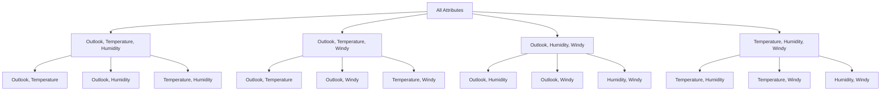

# Attribute Selection in Machine Learning

## Introduction

Attribute selection is a crucial preprocessing step in machine learning that helps improve model performance by selecting the most relevant features while removing irrelevant or redundant ones. This document explores various methods and considerations for attribute selection.

### Real-World Example: House Price Prediction

Imagine you're building a model to predict house prices. You have many potential attributes:

- Essential features: Size, Location, Number of rooms, Age of house
- Potentially relevant: School district rating, Crime rate, Distance to stations
- Likely irrelevant: House number, Owner's name, Last sale date
- Redundant: Total rooms and Number of bedrooms (highly correlated)

Proper attribute selection helps focus on the most important features while removing noise.

## Why Attribute Selection is Important

### Impact on Model Performance

- Adding irrelevant attributes can degrade performance (typically 5-10% in decision trees)
- Even relevant attributes can sometimes be harmful if they fragment the data too much
- The "fragmentation problem" occurs when less data is available for decision making deeper in the tree

#### Example: Student Performance Prediction

Consider predicting student exam performance:

- Relevant attributes: Study hours, Previous grades, Attendance
- Irrelevant attribute: Student ID number
- Harmful relevant attribute: Exact submission time of assignments (too detailed, fragments data)

### Benefits of Attribute Selection

1. Improves learning algorithm performance
2. Speeds up the learning process
3. Provides more compact, interpretable representations
4. Focuses attention on the most relevant variables
5. Reduces dimensionality of the data

## Main Approaches to Attribute Selection

### 1. Filter Method (Scheme-Independent Selection)

- Makes independent assessment based on data characteristics
- Evaluates attributes before learning begins
- Examples:
  - Selecting attributes that uniquely distinguish instances
  - Using decision trees to filter attributes for other algorithms
  - Using linear models to rank attributes by coefficient size

#### Example: Email Spam Detection

In spam detection, filter method might:

1. Calculate how often each word appears in spam vs. non-spam emails
2. Select top 100 most discriminative words
3. Ignore common words like "the", "and" that appear equally in both classes

### 2. Wrapper Method (Scheme-Specific Selection)

- Uses the target learning algorithm as part of the selection process
- Evaluates attribute subsets using the learning algorithm's performance
- More computationally intensive but often more effective

#### Example: Medical Diagnosis

For a heart disease prediction model:

1. Start with all available tests (blood pressure, cholesterol, ECG, etc.)
2. Try different combinations with the specific ML algorithm
3. Find minimal set of tests needed for accurate diagnosis

## Correlation-Based Feature Selection

### Mathematical Foundation

The correlation between two nominal attributes A and B can be measured using the symmetric uncertainty:

\[U(A,B) = 2\frac{H(A) + H(B) - H(A,B)}{H(A) + H(B)}\]

Where:

- H is the entropy function
- H(A,B) is the joint entropy
- The measure always lies between 0 and 1

#### Example: Weather Prediction

For predicting if it will rain:

- High correlation: Humidity and Cloud Cover (U ≈ 0.8)
- Medium correlation: Temperature and Rain (U ≈ 0.5)
- Low correlation: Wind Direction and Temperature (U ≈ 0.1)

### Goodness Measure for Attribute Sets

\[\text{Goodness} = \frac{\sum_j U(A_j,C)}{\sqrt{\sum_i\sum_j U(A_i,A_j)}}\]

Where:

- C is the class attribute
- i and j range over all attributes in the set

## Search Strategies for Attribute Selection

### Common Search Methods

1. Forward Selection

   - Start with no attributes
   - Add one attribute at a time
   - Stop when no improvement is found

2. Backward Elimination

   - Start with all attributes
   - Remove one attribute at a time
   - Stop when no improvement is found

3. Bidirectional Search

   - Combines forward and backward approaches
   - Can start from either end

4. Best-First Search
   - Keeps track of all evaluated subsets
   - Can revisit earlier configurations
   - More thorough but computationally intensive

### Search Space Visualization

## Practical Considerations

### Computational Cost

- With k attributes, forward/backward selection requires O(k²) evaluations
- More sophisticated searches can require up to 2ᵏ evaluations
- Cross-validation multiplies the computational cost

#### Example: Customer Churn Prediction

For a telecom company with 20 customer attributes:

- Simple forward selection: ~400 evaluations
- Exhaustive search: ~1 million evaluations
- With 10-fold cross-validation: 10x more computations

### Acceleration Techniques

1. Race Search

   - Uses statistical tests to eliminate unpromising candidates early
   - Can significantly reduce computation time

2. Pre-selection
   - Rank attributes first using simple metrics
   - Apply more complex selection only to top-ranked attributes
   - Effective for high-dimensional data

#### Example: Gene Expression Analysis

When analyzing 20,000 genes:

1. First rank genes by correlation with disease
2. Take top 200 genes only
3. Apply wrapper method on these 200 genes
4. Reduces computation time from weeks to hours

### Success Story: Selective Naïve Bayes

- Uses forward selection with simple training set performance metric
- Improves performance on datasets where standard Naïve Bayes struggles
- Maintains good performance where Naïve Bayes already works well

#### Example: Document Classification

For categorizing news articles:

- Standard Naïve Bayes using all words: 75% accuracy
- Selective Naïve Bayes with key words only: 85% accuracy
- Processing time reduced from 30 minutes to 5 minutes

## Best Practices

1. Manual Selection

   - Best when domain knowledge is available
   - Requires deep understanding of the problem and attributes

2. Automated Selection

   - Use simpler methods first (correlation-based, information gain)
   - Apply wrapper methods if computational resources allow
   - Consider pre-selection for high-dimensional data

3. Validation
   - Always validate results using cross-validation or holdout sets
   - Be aware of potential overfitting in the selection process
   - Consider the trade-off between accuracy and interpretability

# Quiz

## Q1: Think about how the structure and quality of your features affect the behaviour of different algorithms.

Different machine learning algorithms respond differently to feature characteristics. Understanding these relationships is crucial for effective model development:

### Algorithm-Specific Feature Sensitivitiess

1. Decision Trees

   - Handle non-linear relationships well
   - Robust to outliers
   - Sensitive to feature rotation (e.g., expressing height/width as area)
   - Example: For predicting house prices, trees work better with raw dimensions (length, width) than derived values (area)

2. Linear Models (Linear Regression, Logistic Regression)

   - Assume linear relationships
   - Sensitive to feature scales
   - Benefit from feature normalization
   - Example: Predicting salary where experience (1-40 years) and education level (1-4) need different scaling

3. Neural Networks

   - Require normalized features
   - Can handle complex non-linear relationships
   - Sensitive to feature ranges
   - Example: Image recognition performs better with pixel values scaled to [0,1] range

4. K-Nearest Neighbors
   - Highly sensitive to feature scales
   - Affected by the curse of dimensionality
   - Example: Customer segmentation where income (millions) and age (0-100) need careful scaling

### Feature Quality Impact Examples

1. Categorical Features

   - Poor encoding: Simple numeric mapping (1,2,3...)
   - Better encoding: One-hot encoding or feature embeddings
   - Example: Encoding cities as numbers (Tokyo=1, London=2) suggests an incorrect ordering

2. Temporal Features

   - Poor expression: Raw timestamps
   - Better expression: Derived features (day of week, month, season)
   - Example: Restaurant booking prediction improves when using hour-of-day rather than raw time

3. Numeric Ranges
   - Poor structure: Mixed scales (combining percentages and absolute values)
   - Better structure: Normalized or standardized values
   - Example: Credit scoring models perform better with standardized financial ratios

## Q2: Consider situations where a poorly expressed attribute might limit model performance, and how a simple transformation could make the same information more accessible.

Sometimes, simple transformations can dramatically improve model performance. Here are key scenarios and solutions:

### Common Transformation Scenarios

1. Skewed Distributions

   - Problem: House prices heavily skewed towards lower values
   - Solution: Log transformation
   - Impact: Makes price distribution more normal, improves linear model performance

2. Periodic Features

   - Problem: Wind direction in degrees (0-360)
   - Solution: Convert to sine and cosine components
   - Impact: Preserves circular nature of the data, improves model understanding

3. Composite Features
   - Problem: Separate height and weight measurements
   - Solution: Create BMI (weight/height²)
   - Impact: Captures relationship more effectively than individual features

### Real-World Transformation Examples

1. E-commerce Conversion Rate Prediction

   - Original feature: Raw page visit count
   - Transformation: Visit frequency (visits/time period)
   - Result: 15% improvement in prediction accuracy

2. Manufacturing Quality Control

   - Original features: Individual sensor readings
   - Transformation: Rolling averages and variances
   - Result: Earlier detection of equipment failures

3. Text Classification
   - Original feature: Raw word counts
   - Transformation: TF-IDF scores
   - Result: Better handling of document length variations

### Best Practices for Feature Transformation

1. Domain Knowledge Integration

   - Understand the business meaning of features
   - Consider known relationships between variables
   - Example: Combining pressure and temperature for weather prediction

2. Iterative Improvement

   - Start with simple transformations
   - Monitor impact on model performance
   - Document successful transformations for future projects

3. Validation Considerations
   - Apply transformations consistently to training and test data
   - Beware of data leakage when creating derived features
   - Maintain interpretability where possible

# Quiz2

## Multiple Choice Questions and Answers

### Q1: Feature Extraction and Model Accuracy

**Question:**
Feature extraction always improves model accuracy.

**Choices:**

- True
- False

**Answer: False**

**Explanation:**
Feature extraction doesn't always improve model accuracy. While it can be beneficial in many cases by:

- Reducing noise in the data
- Removing redundant information
- Simplifying the model

It can sometimes harm performance if:

- Important information is lost during extraction
- The extracted features are less informative than the original ones
- The extraction method isn't appropriate for the specific problem

### Q2: Benefits of Using Attribute Subsets

**Question:**
Beyond accuracy, what other advantages are there to using subsets of attributes (even when we already have the data)? Select all correct answers.

**Choices:**

- The resulting models are easier to compare with others (e.g. those trained on using different algorithms or parameter settings)
- The computation to train and run the models is likely to be less
- The resulting models are generally easier to understand

**Answer: All choices are correct**

**Explanation:**
Using attribute subsets offers multiple benefits:

1. **Easier Comparison:**

   - Reduced dimensionality makes model comparison more straightforward
   - Fewer variables to account for in performance differences

2. **Computational Efficiency:**

   - Less data to process
   - Faster training and inference times
   - Reduced memory requirements

3. **Better Interpretability:**
   - Fewer features to analyze
   - Clearer relationships between inputs and outputs
   - More manageable for domain experts to validate

### Q3: Scheme-Dependent Attribute Subsetting

**Question:**
What does it mean to subset attributes in a scheme-dependent way?

**Choices:**

- You apply your planned learning algorithm to every possible subset of attributes, and use the subset that achieves the best accuracy
- You apply your planned learning algorithm to some possible candidate subsets of attributes, and use the subset that achieves the best accuracy

**Answer: You apply your planned learning algorithm to some possible candidate subsets of attributes, and use the subset that achieves the best accuracy**

**Explanation:**
Scheme-dependent attribute selection (wrapper method):

- Uses the target learning algorithm as part of the selection process
- Tests different attribute combinations with the actual model
- Is computationally intensive, so testing ALL possible combinations is usually impractical
- Uses search strategies (like forward selection or backward elimination) to explore promising subsets
- Selects the subset that performs best with the specific learning algorithm

### Q4: Filter Methods in Feature Selection

**Question:**
Which of the following is a filter method in feature selection?

**Choices:**

- Forward stepwise selection using a model
- Information gain ranking
- Decision tree pruning
- Feature elimination via neural networks

**Answer: Information gain ranking**

**Explanation:**
Information gain ranking is a filter method because:

- It evaluates features independently of any learning algorithm
- Uses a statistical measure (information gain) to rank features
- Operates before the learning process begins
- Doesn't require running the actual model

The other options are wrapper or embedded methods because they:

- Forward stepwise selection: Uses the model to evaluate feature subsets
- Decision tree pruning: Part of the tree learning algorithm
- Feature elimination via neural networks: Uses the neural network model directly

Filter methods like information gain ranking are:

- Computationally efficient
- Model-independent
- Can be used as a preprocessing step
- May miss feature interactions that specific models could utilize
