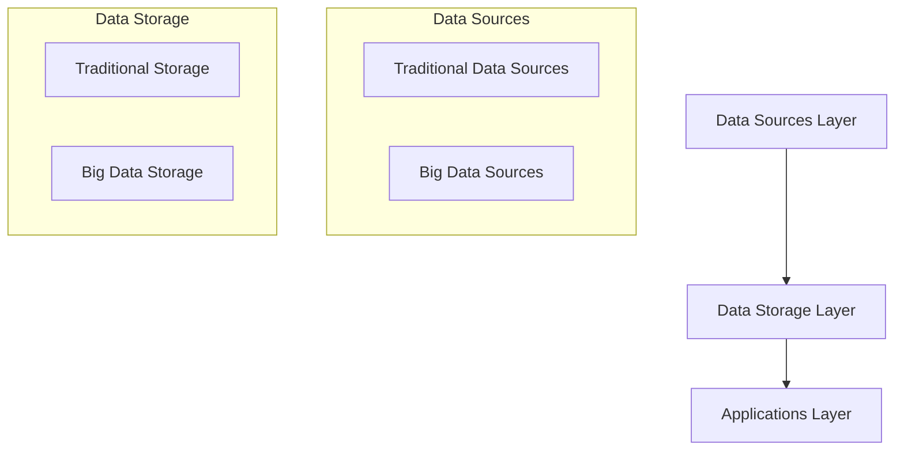
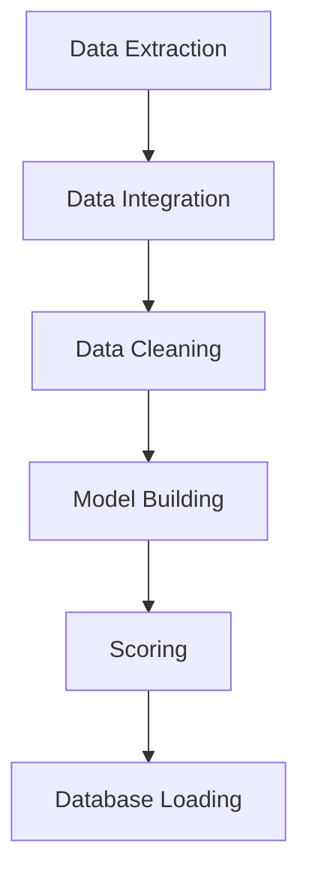
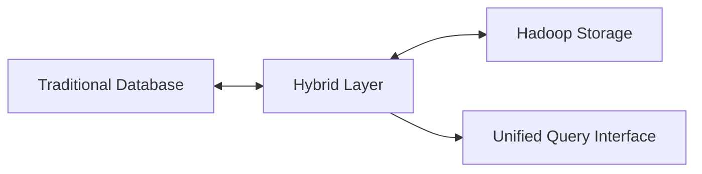

# Data Integration Overview

## 1. Data Science Ecosystem

### 1.1 Basic Structure

The complexity of a data science ecosystem varies according to organizational scale and data volume. It consists of three main layers:

1. Data Sources Layer
2. Data Storage Layer
3. Applications Layer

### 1.2 Approach Options

Organizations can choose from the following approaches:

- Investment in commercial integrated tool sets
- Building a custom ecosystem by integrating open-source tools and languages
- Hybrid solutions combining commercial and open-source products

## 2. Types of Data Sources

### 2.1 Traditional Data Sources

- **OLTP (Online Transaction Processing) Systems**
  - Customer Management Systems
  - Order Systems
  - Manufacturing Management Systems
  - Billing Systems
  - CRM (Customer Relationship Management)
  - ERP (Enterprise Resource Planning)
  - Call Center Systems

### 2.2 Big Data Sources

- Network Traffic
- Application Logs
- Sensor Data
- Web Logs
- Social Media Data
- Website Data

## 3. Data Storage and Data Integration

### 3.1 Traditional Data Integration

#### RDBMS and Data Warehouse

- **Key Components**:
  - Operational Data Store (ODS)
  - MPP Database
  - Data Warehouse

#### ETL (Extract, Transform, Load) Process

Essential processes in data warehousing:

- Data Extraction
- Data Transformation
- Data Loading

### 3.2 OLAP (Online Analytical Processing)

Data warehouse analysis operations:

| Operation Type | Description                          | Example                                               |
| -------------- | ------------------------------------ | ----------------------------------------------------- |
| Slice          | Cut data by specific dimension       | Extract sales data for specific region                |
| Dice           | Cut data cube by multiple dimensions | Sales analysis by region × time period                |
| Pivot          | Change data perspective              | Switch from product-based to region-based aggregation |

### 3.3 Big Data Integration (Hadoop Platform)

- **Features**:
  - Distributed Storage and Processing
  - MapReduce Model Utilization
  - Commodity Server Clusters

#### MapReduce Processing Flow

1. Split: Divide data into multiple chunks
2. Apply: Parallel processing on each chunk
3. Combine: Integration of results

## 4. Integration Architecture Examples

### 4.1 Hybrid Approach

Examples of Data Warehouse and Hadoop combination:

- Recent 3 years of data → Data Warehouse (for fast access)
- Historical data → Hadoop (for long-term storage)

### 4.2 Data Analysis Integration Flow

## 5. Implementation Considerations

### 5.1 Scalability

- Handling Data Volume Growth
- Ensuring Processing Performance
- Storage Capacity Management

### 5.2 Data Quality Management

- Ensuring Data Consistency
- Duplicate Data Removal
- Handling Missing Values

### 5.3 Security Considerations

- Access Control
- Data Encryption
- Audit Log Management

## 6. Scaling and Infrastructure Considerations

### 6.1 Organization Size Impact

- Smaller organizations may not require Hadoop
- Large organizations benefit significantly from Hadoop implementation
- Cost considerations for different scales of operation

### 6.2 Traditional Data Processing

#### Time Distribution in Traditional Process

- 70-80%: Data extraction and preparation
- 20-30%: Model building
- For scoring: 90% data movement, 10% actual scoring

## 7. Modern Database Solutions

### 7.1 In-Database Machine Learning

Key advantages:

- No data movement required
- Up to 100x faster performance
- Enhanced security
- Built-in scalability
- Real-time deployment capabilities
- Simplified production deployment

### 7.2 Success Stories

1. **Fiserv**

   - Reduced model deployment time from 1 week to hours
   - Improved fraud detection capabilities

2. **84.51°**

   - Eliminated 318 hours monthly data movement
   - Reduced model creation time from 67 to 1 hour
   - Achieved 16-day monthly time savings

3. **Wargaming**
   - Managing 120M+ customer interactions
   - Enhanced predictive modeling capabilities

## 8. Big Data Infrastructure

### 8.1 Processing Frameworks

| Framework | Primary Use             | Key Features                           |
| --------- | ----------------------- | -------------------------------------- |
| Hadoop    | Batch Processing        | Large-scale data storage, MapReduce    |
| Storm     | Stream Processing       | 1M+ tuples/second/node                 |
| Spark     | Hybrid (Batch-focused)  | Combined batch and stream capabilities |
| Flink     | Hybrid (Stream-focused) | Stream processing with batch support   |

### 8.2 Vertical Scaling Challenges

- Traditional database limitations
- Cost implications for large-scale data
- Performance considerations

## 9. Hybrid Database Architecture

### 9.1 Integration Approach

### 9.2 Key Features

- Automated data movement based on usage
- Unified SQL interface
- Seamless query distribution
- Intelligent data placement

## 10. Data Preparation and Integration Process

### 10.1 Integration Challenges

- Multiple data sources
- Varying data formats
- Inconsistent identifiers
- Different measurement units

### 10.2 Integration Steps

1. **Data Extraction**

   - Source-specific interfaces
   - Multiple format handling

2. **Data Cleaning**

   - Corrupt data detection
   - Inaccuracy removal
   - Standardization

3. **Data Transformation**
   - Value conversion
   - Data smoothing
   - Binning
   - Normalization

### 10.3 Analytics Base Table Creation

- Attribute selection
- Domain concept integration
- Correlation analysis
- Feature engineering

#### Example: Customer Data Integration

| Data Type        | Sources          | Considerations     |
| ---------------- | ---------------- | ------------------ |
| Contract Details | Internal DB      | Standardization    |
| Demographics     | Multiple Sources | Consistency        |
| Usage Patterns   | Application Logs | Aggregation        |
| Life-cycle Data  | CRM Systems      | Timeline alignment |

### 10.4 Best Practices

- Remove redundant features
- Balance data representation
- Consider domain knowledge
- Validate data relationships
- Maintain data lineage

## 11. Critical Analysis: Questions and Answers

### Question 1: What was the ultimate project goal?

The primary objective was to create an efficient and scalable data integration ecosystem that could handle both traditional and big data processing needs. This goal emerged from the increasing complexity of data management in modern organizations. The project aimed to bridge the gap between conventional database systems and modern big data requirements while maintaining data security and processing efficiency.

Key aspects of the goal included:

- Minimizing data movement and processing time
- Creating a unified data access interface
- Ensuring scalability across different organizational sizes
- Maintaining security and data governance
- Enabling real-time analytics capabilities

### Question 2: What problems did they face?

The organizations encountered several significant challenges:

1. **Time and Resource Consumption**

   - 70-80% of project time spent on data preparation
   - Extensive time spent moving data between systems
   - High costs associated with vertical scaling

2. **Technical Limitations**

   - Traditional databases struggled with large data volumes
   - Complex integration across multiple data sources
   - Inconsistent data formats and standards
   - Limited processing capabilities for real-time analytics

3. **Operational Challenges**
   - Security risks from multiple data extractions
   - Difficulty maintaining data consistency
   - Complex deployment processes for ML models
   - Multiple specialized tools requiring different expertise

### Question 3: What improvements were implemented?

The organizations implemented several innovative solutions:

1. **Architectural Improvements**

   - Hybrid database architecture combining traditional and Hadoop systems
   - In-database machine learning capabilities
   - Unified SQL interface for all data access
   - Automated data placement based on usage patterns

2. **Process Optimizations**

   - Elimination of unnecessary data movement
   - Streamlined model deployment processes
   - Integrated analytics capabilities
   - Automated data lifecycle management

3. **Demonstrated Success**
   - Fiserv: Reduced model deployment from weeks to hours
   - 84.51°: Saved 318 hours monthly in data movement
   - Wargaming: Managed 120M+ customer interactions effectively

### Question 4: What drawbacks does their solution have?

Despite the improvements, several critical limitations and potential issues remain:

1. **Technical Complexities**

   - Increased system management complexity in hybrid environments
   - Potential performance overhead in the integration layer
   - Limited support for specialized features across platforms
   - Need for expertise in multiple technologies

2. **Implementation Challenges**

   - High initial investment in infrastructure and training
   - Potential resistance to organizational change
   - Risk of vendor lock-in with specific solutions
   - Complexity in maintaining system consistency

3. **Strategic Considerations**
   - Solution may be oversized for smaller organizations
   - Dependency on vendor-specific features
   - Potential scalability limitations in extreme cases
   - Need for continuous adaptation to new technologies

### Critical Analysis

The implemented solutions represent a significant advancement in data integration and processing capabilities. However, success depends heavily on:

1. **Organizational Factors**

   - Size and scale of operations
   - Technical expertise availability
   - Resource allocation capabilities
   - Long-term strategic alignment

2. **Technical Considerations**

   - Existing infrastructure compatibility
   - Data volume and velocity requirements
   - Security and compliance needs
   - Integration with legacy systems

3. **Future Adaptability**
   - Flexibility for emerging technologies
   - Scalability for growing data needs
   - Maintenance of competitive advantage
   - Evolution of data processing requirements

The hybrid approach, while powerful, is not a universal solution. Organizations must carefully evaluate their specific needs, capabilities, and growth projections before implementing such complex systems. The success stories demonstrate the potential benefits, but also highlight the significant investment and expertise required for successful implementation.
