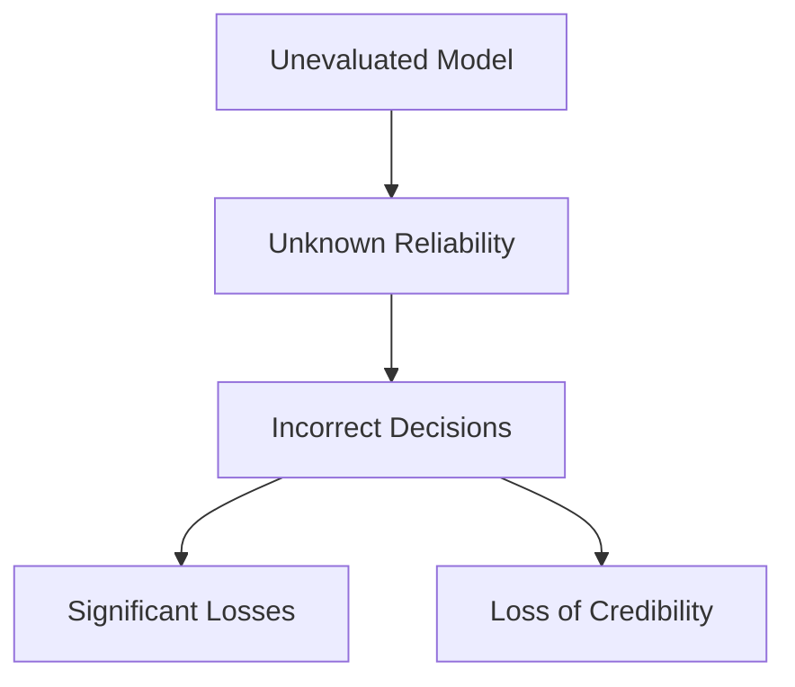

# Comprehensive Guide to Model Evaluation

## Table of Contents

1. [What is Model Evaluation?](#what-is-model-evaluation)
2. [Importance of Model Evaluation](#importance-of-model-evaluation)
3. [Model Performance Evaluation Methods](#model-performance-evaluation-methods)
4. [Specific Evaluation Metrics](#specific-evaluation-metrics)
5. [Practical Examples](#practical-examples)
6. [Common Pitfalls and Considerations](#common-pitfalls-and-considerations)

## What is Model Evaluation?

Model evaluation is the process of assessing how well a machine learning model performs on actual tasks. This includes:

- Validating prediction accuracy
- Confirming model reliability
- Determining suitability for real-world use

### Basic Evaluation Framework

| Aspect          | Key Considerations                           | Importance |
| --------------- | -------------------------------------------- | ---------- |
| Accuracy        | How precise are the predictions              | ★★★        |
| Reliability     | How stable are the results                   | ★★★        |
| Practicality    | Can it handle real-world use                 | ★★         |
| Cost Efficiency | Are computational costs and time appropriate | ★★         |

## Importance of Model Evaluation

### Why is Model Evaluation Critical?

1. **Ensuring Decision Reliability**

   - Example: Credit card approval decisions
   - High cost of incorrect judgments
   - Need to know prediction confidence levels

2. **Risk Management**
   - Understanding model limitations
   - Assessing impact of prediction errors
   - Determining appropriate usage scope

### Dangers of Unevaluated Models



## Model Performance Evaluation Methods

### 1. Data Splitting Approaches

| Method                  | Description                                   | Advantages          | Disadvantages                   |
| ----------------------- | --------------------------------------------- | ------------------- | ------------------------------- |
| Train/Test Split        | Divide data into training and testing sets    | Simple              | Not suitable for small datasets |
| k-fold Cross-validation | Split data into k parts and test sequentially | Higher reliability  | Higher computational cost       |
| Holdout Method          | Prepare completely independent test set       | Highest reliability | Requires large dataset          |

### 2. Error Score Calculation

Main evaluation metrics for regression models:

```python
# Mean Squared Error (MSE) example
MSE = (1/n) * Σ(actual_value - predicted_value)²
```

## Specific Evaluation Metrics

### Regression Model Metrics

| Metric | Calculation Method                 | Characteristics                 |
| ------ | ---------------------------------- | ------------------------------- |
| MSE    | Mean of squared prediction errors  | Sensitive to large errors       |
| MAE    | Mean of absolute prediction errors | Robust to outliers              |
| R²     | Coefficient of determination       | Shows model's explanatory power |

### Classification Model Metrics

| Metric    | Description                           | Use Case                        |
| --------- | ------------------------------------- | ------------------------------- |
| Accuracy  | Proportion of correct classifications | Balanced datasets               |
| Precision | Accuracy of positive predictions      | When false positives are costly |
| Recall    | Detection rate of actual positives    | When false negatives are costly |

## Practical Examples

### Iris Dataset Evaluation Example

```python
# Evaluation results example
Model 1 (Simple Average): MSE = 0.681
Model 2 (Linear Regression): MSE = 0.122
```

Visualization comparison:

```
Sepal Length Prediction
Actual value:    ●
Simple average:  ━━━
Linear regression: ▲

    ▲     ●
●   ━━━━━━━━━━
    ▲     ●
```

### Labor Data Classification Example

| Model             | Training Data Accuracy | Cross-validation Accuracy |
| ----------------- | ---------------------- | ------------------------- |
| J48 Decision Tree | 98%                    | 96%                       |
| SMO Classifier    | 95%                    | 89%                       |

## Common Pitfalls and Considerations

1. **The Overfitting Trap**

   - Symptoms:
     - Perfect performance on training data
     - Poor performance on new data
     - Model learns noise instead of patterns
   - Real Example:
     ```python
     # Housing price prediction
     Training MSE: 0.02  # Suspiciously low
     Test MSE: 15.7     # Much higher in reality
     ```
   - Prevention:
     - Use cross-validation
     - Monitor validation curves
     - Implement regularization
     - Simplify model architecture

2. **Data Representation Issues**

   - Common Problems:
     - Temporal mismatch (training on old data, testing on new)
     - Geographic bias (training on US data, testing on EU data)
     - Demographic skew (training on one age group, testing on another)
   - Case Study:
     ```
     Facial Recognition System
     Training: 90% accuracy on development set
     Production: 65% accuracy on diverse user base
     Root Cause: Training data lacked diversity
     ```
   - Solutions:
     - Collect diverse test data
     - Perform stratified sampling
     - Regular dataset audits
     - Continuous monitoring in production

3. **Metric Selection Mistakes**

   - Scenario Examples:
     - Using accuracy for imbalanced fraud detection
     - Applying MSE to non-normal distributions
     - Ignoring business costs in metric selection
   - Better Approaches:
     - Fraud Detection: Use precision-recall curve
     - Skewed Data: Consider median absolute error
     - Cost-Sensitive: Implement custom metrics

4. **Production Environment Mismatch**

   - Common Issues:
     - Different data distributions
     - Varying latency requirements
     - Resource constraints
   - Example:
     ```
     Model Performance:
     Development: 100ms response time
     Production: 2.5s response time (unacceptable)
     Cause: Different hardware, larger data volume
     ```
   - Mitigation:
     - Test in production-like environment
     - Performance profiling
     - Load testing
     - Resource monitoring

5. **Feedback Loop Problems**
   - Types:
     - Direct feedback loops
     - Hidden feedback loops
     - Delayed feedback
   - Real World Example:
     ```
     Recommendation System:
     Initial CTR: 8%
     After 6 months: 4%
     Issue: Model reinforced popular but low-quality content
     ```
   - Prevention:
     - A/B testing
     - Control groups
     - Regular model retraining
     - Diversity metrics

### Conclusion

Model evaluation is crucial for machine learning project success. Always consider:

- Choosing appropriate evaluation methods
- Using multiple evaluation metrics
- Considering real-world usage conditions
- Implementing continuous monitoring and re-evaluation

> **Important**: Unevaluated models are not suitable for production use. Ensure model reliability through proper evaluation processes.

### Best Practices Checklist

✓ Establish baseline metrics  
✓ Use cross-validation when possible  
✓ Test on independent datasets  
✓ Monitor production performance  
✓ Plan for model maintenance  
✓ Document evaluation procedures  
✓ Set up automated testing  
✓ Review and update regularly
