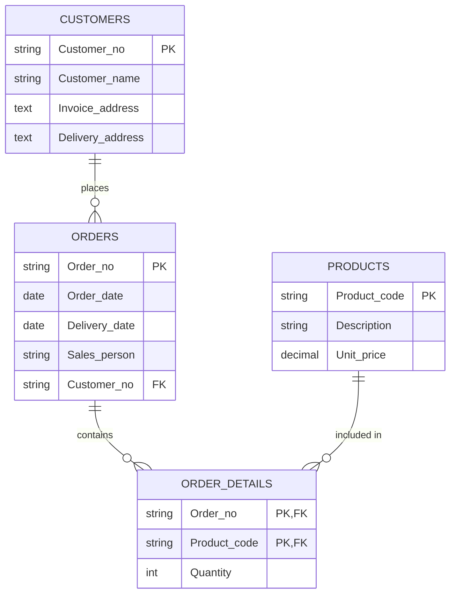

# Database Normalization Exercise

## Problem: Sales Order Record Normalization

### Original Data: Sales Order Record

```
SALES ORDER
Order no: 10345
Order date: April 1 2020
Delivery date: April 4 2020
Sales person: John Smith
Customer no: JJ74553
Customer name: Joe Brown
Invoice address: 13 Manor Park Gardens, Scarborough, YO19 2ED
Delivery address: Seaview Industrial Estate, Scarborough, YO19 6YH

ORDER DETAILS
Product code | Description        | Quantity | Unit price | Amount
EPS02994     | Black Ink Cartridge| 3        | 13.80      | 41.40
IOM100       | USB Memory stick   | 5        | 10.47      | 52.35
MSPS2        | White Mouse        | 1        | 6.95       | 6.95

Order value: 100.71
```

## Normalization Steps

### Step 1: From Unnormalized Form (UNF) to First Normal Form (1NF)

#### Attribute List in UNF

```
- Order no (Primary Key)
- Order date
- Delivery date
- Sales person
- Customer no
- Customer name
- Invoice address
- Delivery address
- Product code
- Description
- Quantity
- Unit price
```

**Notes**:

- Order value and Amount are excluded from the attribute list as they can be calculated from other attributes
- Names and addresses are treated as single fields for simplification (should be split in practice)

### Step 2: Converting to First Normal Form (1NF)

Separating repeating items into separate tables.

#### Table 1: Order Information

```sql
CREATE TABLE Orders (
    Order_no VARCHAR(10),
    Order_date DATE,
    Delivery_date DATE,
    Sales_person VARCHAR(100),
    Customer_no VARCHAR(10),
    Customer_name VARCHAR(100),
    Invoice_address TEXT,
    Delivery_address TEXT,
    PRIMARY KEY (Order_no)
);
```

#### Actual Data Example (Orders):

| Order_no | Order_date | Delivery_date | Sales_person | Customer_no | Customer_name | Invoice_address                    | Delivery_address                       |
| -------- | ---------- | ------------- | ------------ | ----------- | ------------- | ---------------------------------- | -------------------------------------- |
| 10345    | 2020-04-01 | 2020-04-04    | John Smith   | JJ74553     | Joe Brown     | 13 Manor Park Gardens, Scarborough | Seaview Industrial Estate, Scarborough |
| 10346    | 2020-04-01 | 2020-04-05    | John Smith   | JJ74554     | Sarah Wilson  | 15 High Street, York               | 15 High Street, York                   |

#### Table 2: Order Details

```sql
CREATE TABLE Order_Details (
    Order_no VARCHAR(10),
    Product_code VARCHAR(10),
    Description VARCHAR(100),
    Quantity INT,
    Unit_price DECIMAL(10,2),
    PRIMARY KEY (Order_no, Product_code)
);
```

#### Actual Data Example (Order_Details):

| Order_no | Product_code | Description         | Quantity | Unit_price |
| -------- | ------------ | ------------------- | -------- | ---------- |
| 10345    | EPS02994     | Black Ink Cartridge | 3        | 13.80      |
| 10345    | IOM100       | USB Memory stick    | 5        | 10.47      |
| 10345    | MSPS2        | White Mouse         | 1        | 6.95       |
| 10346    | EPS02994     | Black Ink Cartridge | 2        | 13.80      |

### Step 3: Converting to Second Normal Form (2NF)

Removing partial functional dependencies.

#### Table 1: Order Information

```sql
CREATE TABLE Orders (
    Order_no VARCHAR(10),
    Order_date DATE,
    Delivery_date DATE,
    Sales_person VARCHAR(100),
    Customer_no VARCHAR(10),
    Customer_name VARCHAR(100),
    Invoice_address TEXT,
    Delivery_address TEXT,
    PRIMARY KEY (Order_no)
);
```

#### Actual Data Example (Orders):

| Order_no | Order_date | Delivery_date | Sales_person | Customer_no |
| -------- | ---------- | ------------- | ------------ | ----------- |
| 10345    | 2020-04-01 | 2020-04-04    | John Smith   | JJ74553     |
| 10346    | 2020-04-01 | 2020-04-05    | John Smith   | JJ74554     |

#### Table 2: Order Details (Junction Table)

```sql
CREATE TABLE Order_Details (
    Order_no VARCHAR(10),
    Product_code VARCHAR(10),
    Quantity INT,
    PRIMARY KEY (Order_no, Product_code)
);
```

#### Actual Data Example (Order_Details):

| Order_no | Product_code | Quantity |
| -------- | ------------ | -------- |
| 10345    | EPS02994     | 3        |
| 10345    | IOM100       | 5        |
| 10345    | MSPS2        | 1        |
| 10346    | EPS02994     | 2        |

#### Table 3: Product Information

```sql
CREATE TABLE Products (
    Product_code VARCHAR(10),
    Description VARCHAR(100),
    Unit_price DECIMAL(10,2),
    PRIMARY KEY (Product_code)
);
```

#### Actual Data Example (Products):

| Product_code | Description         | Unit_price |
| ------------ | ------------------- | ---------- |
| EPS02994     | Black Ink Cartridge | 13.80      |
| IOM100       | USB Memory stick    | 10.47      |
| MSPS2        | White Mouse         | 6.95       |

### Step 4: Converting to Third Normal Form (3NF)

Removing transitive dependencies.

#### Table 1: Order Information

```sql
CREATE TABLE Orders (
    Order_no VARCHAR(10),
    Order_date DATE,
    Delivery_date DATE,
    Sales_person VARCHAR(100),
    Customer_no VARCHAR(10),
    PRIMARY KEY (Order_no),
    FOREIGN KEY (Customer_no) REFERENCES Customers(Customer_no)
);
```

#### Actual Data Example (Orders):

| Order_no | Order_date | Delivery_date | Sales_person | Customer_no |
| -------- | ---------- | ------------- | ------------ | ----------- |
| 10345    | 2020-04-01 | 2020-04-04    | John Smith   | JJ74553     |
| 10346    | 2020-04-01 | 2020-04-05    | John Smith   | JJ74554     |

#### Table 2: Customer Information

```sql
CREATE TABLE Customers (
    Customer_no VARCHAR(10),
    Customer_name VARCHAR(100),
    Invoice_address TEXT,
    Delivery_address TEXT,
    PRIMARY KEY (Customer_no)
);
```

#### Actual Data Example (Customers):

| Customer_no | Customer_name | Invoice_address                    | Delivery_address                       |
| ----------- | ------------- | ---------------------------------- | -------------------------------------- |
| JJ74553     | Joe Brown     | 13 Manor Park Gardens, Scarborough | Seaview Industrial Estate, Scarborough |
| JJ74554     | Sarah Wilson  | 15 High Street, York               | 15 High Street, York                   |

#### Table 3: Order Details

```sql
CREATE TABLE Order_Details (
    Order_no VARCHAR(10),
    Product_code VARCHAR(10),
    Quantity INT,
    PRIMARY KEY (Order_no, Product_code),
    FOREIGN KEY (Order_no) REFERENCES Orders(Order_no),
    FOREIGN KEY (Product_code) REFERENCES Products(Product_code)
);
```

#### Actual Data Example (Order_Details):

| Order_no | Product_code | Quantity |
| -------- | ------------ | -------- |
| 10345    | EPS02994     | 3        |
| 10345    | IOM100       | 5        |
| 10345    | MSPS2        | 1        |
| 10346    | EPS02994     | 2        |

#### Table 4: Product Information

```sql
CREATE TABLE Products (
    Product_code VARCHAR(10),
    Description VARCHAR(100),
    Unit_price DECIMAL(10,2),
    PRIMARY KEY (Product_code)
);
```

#### Actual Data Example (Products):

| Product_code | Description         | Unit_price |
| ------------ | ------------------- | ---------- |
| EPS02994     | Black Ink Cartridge | 13.80      |
| IOM100       | USB Memory stick    | 10.47      |
| MSPS2        | White Mouse         | 6.95       |

### Step 5: Logical Data Model (ER Diagram)



## Normalization Explanation

### 1. From UNF to 1NF

- Separating repeating groups (order details) into separate tables
- Organizing each attribute to contain only atomic values

### 2. From 1NF to 2NF

- Removing partial functional dependencies
- Separating product descriptions and unit prices from product code

### 3. From 2NF to 3NF

- Removing transitive dependencies
- Separating customer information from customer number

### Advantages

1. Reducing data redundancy
2. Improving data consistency
3. Preventing update, delete, and insertion anomalies
4. Allowing more flexible data operations

### Notes

1. Join operations between tables are required
2. Query complexity may increase
3. Performance considerations should be taken into account
