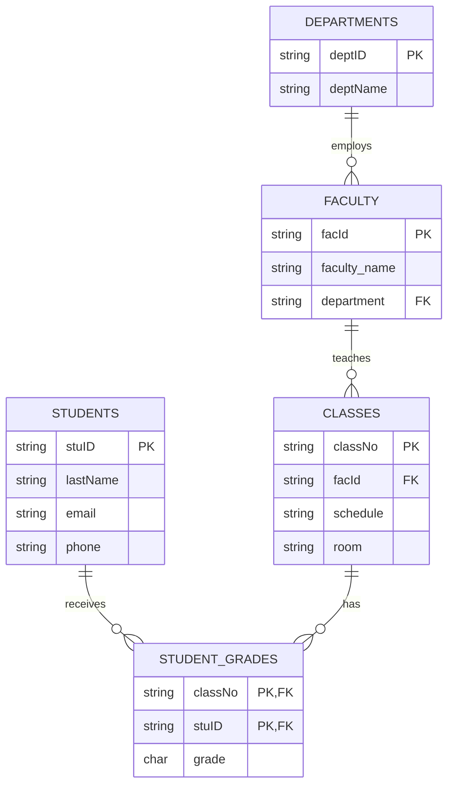

# Database Normalization: Theory and Practice

## 1. Fundamentals of Database Normalization

### 1.1 What is Normalization?

Database normalization is a systematic process of organizing data in a database to reduce data redundancy and improve data integrity.
It's not just a theoretical exercise but a practical process essential for designing efficient and reliable databases.

### 1.2 Objectives of Normalization

1. **Eliminate Redundancy**: Prevent the same data from existing in multiple locations
2. **Ensure Data Integrity**: Maintain consistency and accuracy of data
3. **Improve Flexibility**: Enhance system scalability and maintainability
4. **Optimize Performance**: Enable efficient data operations

## 2. Database Anomalies

### 2.1 Example of an Unnormalized Table

Let's start with a university class database that contains various anomalies:

```sql
CREATE TABLE UnormalizedClasses (
    classNo VARCHAR(10),    -- Class number
    stuID VARCHAR(10),      -- Student ID
    lastName VARCHAR(50),   -- Student's last name
    facId VARCHAR(10),      -- Faculty ID
    schedule VARCHAR(20),   -- Class schedule
    room VARCHAR(10),       -- Classroom
    grade CHAR(1),         -- Grade
    PRIMARY KEY (classNo, stuID)
);
```

#### Actual Data Example:

| classNo | stuID | lastName | facId | schedule | room | grade |
| ------- | ----- | -------- | ----- | -------- | ---- | ----- |
| ART103a | S1001 | Smith    | F101  | MWF9     | H221 | A     |
| HCI101b | S1010 | Burns    | F111  | ThF11    | Q001 | NULL  |
| ART103a | S1006 | Lee      | F101  | MWF9     | H221 | B     |
| CSC201a | S1001 | Smith    | F105  | TuThF10  | M110 | A     |
| CSC201a | S1006 | Lee      | F105  | TuThF10  | M110 | C     |

### 2.2 Types of Anomalies

#### Update Anomaly

If we need to change the schedule for ART103a from MWF9 to MWF10, we must update multiple rows. Missing any row would lead to inconsistent data.

#### Delete Anomaly

If student S1010 drops HCI101b (by deleting that row), we lose all information about the HCI101b class, including faculty, schedule, and room information.

#### Insert Anomaly

We cannot add a new class MTH101a until at least one student enrolls (because stuID is part of the primary key).

## 3. Normalization Process

### 3.1 First Normal Form (1NF)

**Definition**: A table is in 1NF if it contains atomic (indivisible) values only.

Let's start with a problematic table that violates 1NF:

#### Before 1NF:

| stuID | courses          | contact                           |
| ----- | ---------------- | --------------------------------- |
| S1001 | ART103a, CSC201a | phone: 555-0101, email: smith@edu |
| S1006 | ART103a, CSC201a | phone: 555-0106                   |

#### After 1NF:

**Students Table**:
| stuID | phone | email |
|-------|-----------|--------------|
| S1001 | 555-0101 | smith@edu |
| S1006 | 555-0106 | NULL |

**Student_Courses Table**:
| stuID | courseID |
|-------|----------|
| S1001 | ART103a |
| S1001 | CSC201a |
| S1006 | ART103a |
| S1006 | CSC201a |

### 3.2 Second Normal Form (2NF)

**Definition**: A table is in 2NF if it's in 1NF and all non-key attributes are fully functionally dependent on the entire primary key.

Let's normalize our university class database further:

#### Current State (1NF):

| classNo | stuID | lastName | facId | schedule | room | grade |
| ------- | ----- | -------- | ----- | -------- | ---- | ----- |
| ART103a | S1001 | Smith    | F101  | MWF9     | H221 | A     |
| ART103a | S1006 | Lee      | F101  | MWF9     | H221 | B     |

#### After 2NF:

**Student_Grades Table** (Primary relationship):
| classNo | stuID | grade |
|---------|-------|-------|
| ART103a | S1001 | A |
| ART103a | S1006 | B |

**Class_Details Table** (Dependent on classNo only):
| classNo | facId | schedule | room |
|---------|-------|----------|-------|
| ART103a | F101 | MWF9 | H221 |

**Students Table** (Dependent on stuID only):
| stuID | lastName |
|-------|----------|
| S1001 | Smith |
| S1006 | Lee |

### 3.3 Third Normal Form (3NF)

**Definition**: A table is in 3NF if it's in 2NF and has no transitive dependencies between non-key attributes.

Let's identify and remove transitive dependencies:

#### Before 3NF (Class_Details table has transitive dependencies):

| classNo | facId | schedule | room | faculty_name | department |
| ------- | ----- | -------- | ---- | ------------ | ---------- |
| ART103a | F101  | MWF9     | H221 | Dr. Johnson  | Arts       |
| CSC201a | F105  | TuThF10  | M110 | Dr. Smith    | CompSci    |

#### After 3NF:

**Class_Details Table**:
| classNo | facId | schedule | room |
|---------|-------|----------|-------|
| ART103a | F101 | MWF9 | H221 |
| CSC201a | F105 | TuThF10 | M110 |

**Faculty Table**:
| facId | faculty_name | department |
|-------|--------------|------------|
| F101 | Dr. Johnson | Arts |
| F105 | Dr. Smith | CompSci |

## 4. Final Database Structure

### 4.1 Entity Relationship Diagram



### 4.2 Benefits of This Structure

1. **Data Integrity**: Each piece of information is stored in exactly one place
2. **Flexibility**: Easy to modify class schedules or faculty assignments
3. **Scalability**: New students, classes, or faculty can be added without structural changes
4. **Query Efficiency**: Data can be accessed and combined in multiple ways

## 5. Practical Considerations

### 5.1 Advantages

1. Elimination of data redundancy
2. Prevention of update/delete/insert anomalies
3. Better data organization
4. Improved data consistency

### 5.2 Trade-offs

1. More complex queries due to table joins
2. Potential performance impact for certain operations
3. Need for careful index planning

### 5.3 Best Practices

1. Always normalize to at least 3NF initially
2. Consider denormalization only when necessary for performance
3. Document all dependencies and relationships
4. Use appropriate data types and constraints
5. Plan for scalability from the start

## 6. Summary

Database normalization is a step-by-step process that transforms an unnormalized database into a well-structured, efficient system. The process:

1. Starts with identifying all data elements
2. Moves through 1NF, 2NF, and 3NF
3. Eliminates redundancies and anomalies
4. Results in a robust, maintainable database structure

Remember that while normalization is important, it should be balanced with practical considerations such as performance requirements and business needs.
